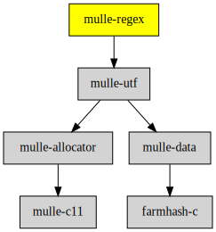

# mulle-regex

#### 📣 Unicode regex library

A simple regular expression library fit for most purposes.

> This is a version of Henry Spencers well-known regular-expression package,
> regexp(3) adapted for unicode.

It gives C programs the ability to use egrep-style regular expressions.
It is not, alas, fully POSIX.2-compliant; that is hard.

This version is the one which is examined and explained in one chapter of
"Software Solutions in C" (Dale Schumacher, ed.; AP Professional 1994;
ISBN 0-12-632360-7), plus a couple of insignificant updates, plus one
significant bug fix (done 10 Nov 1995).

This implementation uses nondeterministic automata rather than the
deterministic ones found in some other implementations, which makes it
simpler, smaller, and faster at compiling regular expressions, but slower
at executing them.  Many users have found the speed perfectly adequate,
although replacing the insides of egrep with this code would be a mistake.

The code is in general less forgiving than the original Henry Spencers code.
For substitution you have to give the length of the destination buffer,
to protect against overflows. There are a few added convenience methods.


| Release Version                                       | Release Notes
|-------------------------------------------------------|--------------
|  [](//github.com/mulle-c/mulle-regex/actions) | [RELEASENOTES](RELEASENOTES.md) |


### You are here




## Add

**This project is a component of the [mulle-core](//github.com/mulle-core/mulle-core) library. As such you usually will *not* add or install it
individually, unless you specifically do not want to link against
`mulle-core`.**


### Add as an individual component

Use [mulle-sde](//github.com/mulle-sde) to add mulle-regex to your project:

``` sh
mulle-sde add github:mulle-c/mulle-regex
```

To only add the sources of mulle-regex with dependency
sources use [clib](https://github.com/clibs/clib):


``` sh
clib install --out src/mulle-c mulle-c/mulle-regex
```

Add `-isystem src/mulle-c` to your `CFLAGS` and compile all the sources that were downloaded with your project.


## Install

### Install with mulle-sde

Use [mulle-sde](//github.com/mulle-sde) to build and install mulle-regex and all dependencies:

``` sh
mulle-sde install --prefix /usr/local \
   https://github.com/mulle-c/mulle-regex/archive/latest.tar.gz
```

### Manual Installation

Install the requirements:

| Requirements                                 | Description
|----------------------------------------------|-----------------------
| [mulle-utf](https://github.com/mulle-c/mulle-utf)             | 🔤 UTF8-16-32 analysis and manipulation library

Download the latest [tar](https://github.com/mulle-c/mulle-regex/archive/refs/tags/latest.tar.gz) or [zip](https://github.com/mulle-c/mulle-regex/archive/refs/tags/latest.zip) archive and unpack it.

Install **mulle-regex** into `/usr/local` with [cmake](https://cmake.org):

``` sh
cmake -B build \
      -DCMAKE_INSTALL_PREFIX=/usr/local \
      -DCMAKE_PREFIX_PATH=/usr/local \
      -DCMAKE_BUILD_TYPE=Release &&
cmake --build build --config Release &&
cmake --install build --config Release
```

## Acknowledgments

```
Copyright (c) 1986, 1993, 1995 by University of Toronto.
Written by Henry Spencer.  Not derived from licensed software.
Permission is granted to anyone to use this software for any
purpose on any computer system, and to redistribute it in any way,
subject to the following restrictions:

1. The author is not responsible for the consequences of use of
this software, no matter how awful, even if they arise
from defects in it.

2. The origin of this software must not be misrepresented, either
by explicit claim or by omission.

3. Altered versions must be plainly marked as such, and must not
be misrepresented (by explicit claim or omission) as being
the original software.

4. This notice must not be removed or altered.
```

The original distribution might still live at ftp://ftp.zoo.toronto.edu/pub/bookregexp.{tar|shar}.

## Author

[Nat!](https://mulle-kybernetik.com/weblog) for Mulle kybernetiK  
[Henry Spencer!]() for University of Toronto  


